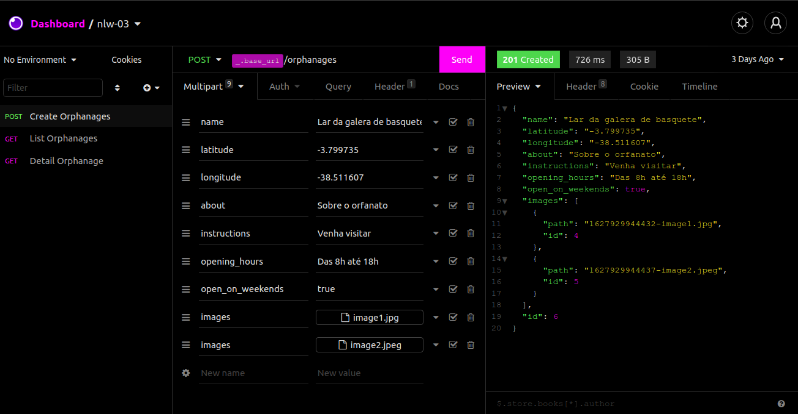

<h1 align="center">
    
</h1>

    

## :rocket: Tecnologias

Foram usadas as seguintes tecnologias:

- [Node.js](https://nodejs.org/en/)
- [React](https://reactjs.org)
- [React Native](https://reactnative.dev)
- [Expo](https://expo.io)
- [Typescript](https://www.typescriptlang.org)

## :computer: Projeto

Projeto desenvolvido durante a 3ª edição do Next Level Week pela [Rocketseat](https://rocketseat.com.br), com o objetivo de ajudar pessoas a se conectarem à casas de acolhimento institucional, para levar brinquedos e brincar com as crianças, fazendo assim o dia delas mais feliz.

[Blog](https://blog.rocketseat.com.br/typescript-vantagens-mitos-conceitos/) e [video](https://www.youtube.com/watch?v=0mYq5LrQN1s) da Rocketseat parar tirar dúvidas sobre o uso do Typescript.

backend
rodar o yarn para instalar as dependencias

## :thinking: Como rodar o projeto?

#### Rodar o backend

1. Rodar `yarn install` no terminal para instalar as dependências
2. Depois executar `yarn dev` para inicializar o servidor

#### Rodar o frontend web

1. Criar uma conta no [Mapbox](https://www.mapbox.com/) ou logar caso ja tenha uma
2. Criar um arquivo `.env` na raiz do projeto web
3. Copiar o Access Token do mapbox e colocar no arquivo `.env` como `REACT_APP_MAPBOX_TOKEN=access_token`
4. Rodar `yarn install` no terminal para instalar as dependências
5. Rodar `yarn start` para inicializar o site

#### Rodar o mobile

1. Rodar `yarn install` no terminal para instalar as dependências
2. Rodar `expo start` para inicializar o expo
3. Agora você tem a opção de rodar pelo seu emulador, ou pelo seu próprio dispositivo físico

#### Para acessar a api

<h1 align="center">
    
</h1>

Baixo o [Insomnia](https://insomnia.rest), clique em `Application > Preferences > Data > Import Data > From URL`, e cole a seguinte url `https://github.com/erik-ferreira/next-level-week-3/blob/main/Insomnia_2021-08-05.json`
